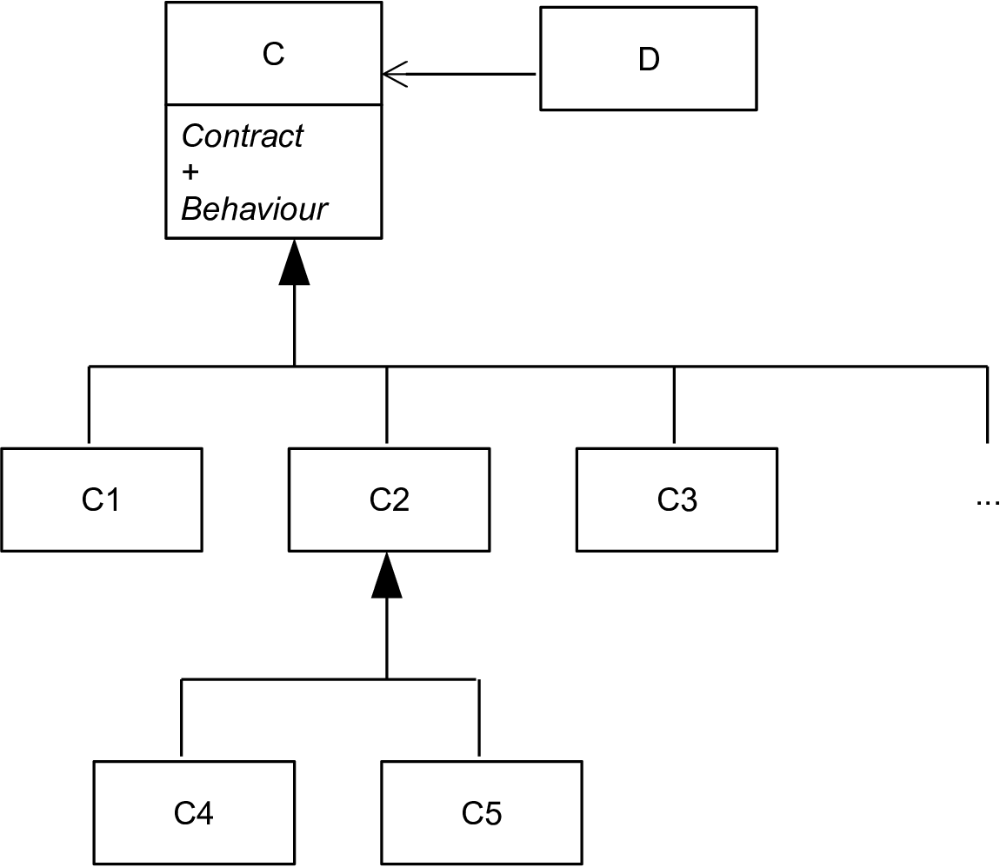
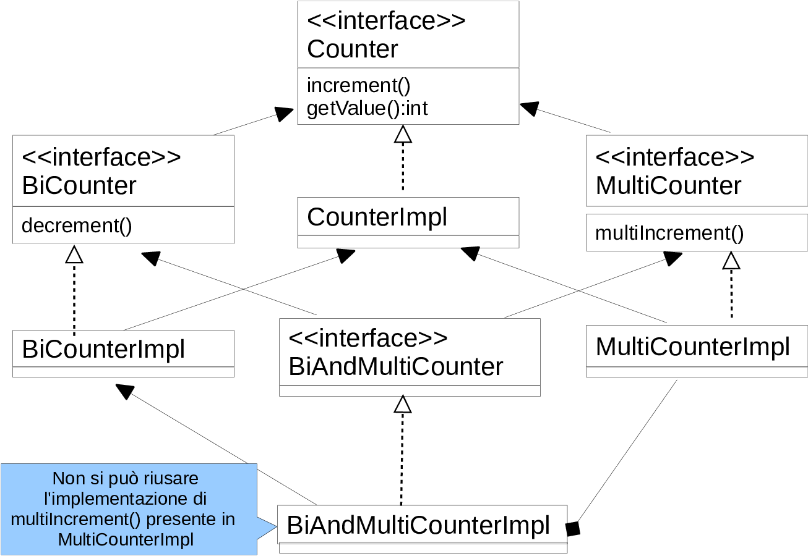
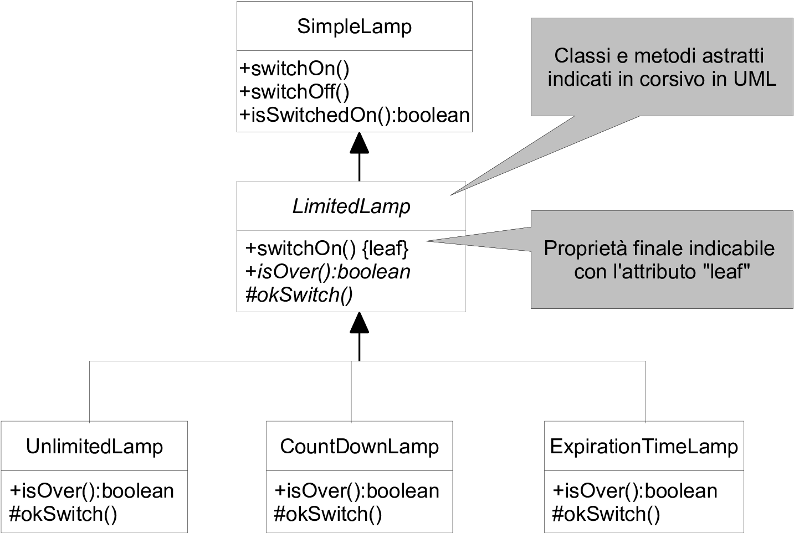

+++

title = "Progettazione e Sviluppo del Software"
description = "Progettazione e Sviluppo del Software, Tecnologie dei Sistemi Informatici"
outputs = ["Reveal"]
aliases = ["/polymorphism/"]

+++

# Polimorfismo

{}

---


## Outline


  
### Goal della lezione


*  Illustrare la connessione fra polimorfismo inclusivo e ereditarietà
*  Mostrare le interconnessioni con interfacce e classi astratte
*  Mostrare le varie ripercussioni nel linguaggio
  


  
### Argomenti


*  Polimorfismo inclusivo con le classi
*  Layout oggetti in memoria
*  Autoboxing dei tipi primitivi
*  Tipi a run-time (cast, `instanceof`)
*  Classi astratte
  


---


# Polimorfismo inclusivo con le classi

---


## Ereditarietà e polimorfismo


  
### Ricordando il principio di sostituibilità


Se `B` è un sottotipo di `A` allora ogni oggetto di `B` può essere utilizzato (e "deve poter" essere utilizzabile) dove ci si attende un oggetto di `A`
  

  
### Con l'ereditarietà


*  Con la definizione: `class B extends A { ... }`
*  Gli oggetti della classe `B` rispondono a tutti i messaggi previsti dalla classe `A` (ed eventualmente a qualcuno in più)
*  Quindi un oggetto della classe `B` potrebbe essere passato dove se ne aspetta uno della classe `A`, senza comportare problemi (di "typing")
  


  
### Conseguenza:


Visto che è possibile, corretto, ed utile, allora in Java si considera `B` come un sottotipo di `A` a tutti gli effetti!
  


---


## Polimorfismo con le classi





---


## Polimorfismo con le classi


  
### In una classe `D` che usi una classe `C`...


*  ci saranno punti in `D` in cui ci si attende oggetti della classe `C`
    * come argomenti a metodi, o da depositare nei campi..


*  si potranno effettivamente passare oggetti della classe `C`, ma anche delle classi `C1`, `C2`,..,`C5`, o di ogni altra classe successivamente creata che estende, direttamente o indirettamente `C`
  
<div class="container">
<div class="col">

```java
class D {
    C c;
    public D(C c) { this.c = c; }
}
```

</div>
<div class="col">

```java
class C { }
class C1 extends C { }

new D(new C1()); // OK
```

</div></div>

  
### Le sottoclassi di `C`

A tutti gli effetti, gli oggetti delle sottoclassi di `C` sono compatibili con gli oggetti della classe `C`

*  supportano lo *stesso contratto* (in generale, qualche operazione in più)
*  hanno lo *stesso stato*, ovveto gli stessi campi definiti in `C` (in generale, qualcuno in più)
*  hanno auspicabilmente un comportamento compatibile
  


---


## Layout oggetti in memoria


  
### Alcuni aspetti del layout degli oggetti in memoria...


Diamo alcune informazioni generali e astratte. Ogni JVM potrebbe realizzare gli oggetti in modo un po' diverso. Questi elementi sono tuttavia comuni.
  

  
### Struttura di un oggetto in memoria


*  Inizia con una intestazione ereditata da `Object` (16 byte circa), che include 
    *  Indicazione di quale sia la *classe dell'oggetto* (runtime type information)
    *  *Tabella dei puntatori ai metodi*, per supportare il late-binding
    *  I campi (privati) della classe `Object`

*  Via via tutti i campi della classe, a partire da quelli delle superclassi
  


  
### Conseguenze: se la classe `C` è sottoclasse di `A`...


Allora un oggetto di `C` è simile ad un oggetto di `A`, ha solo *informazioni aggiuntive* in fondo, e questo semplifica la sostituibilità!
  


---


## Esempio applicazione polimorfismo fra classi -- UML


  


---


## `Person`


```java
{}
```

---


## `Student`


```java
{}
```

---


## `Teacher`


```java
{}
```

---


## `UsePerson`


```java
{}
```  


---


## La differenza col caso del polimorfismo con le interfacce


  
### Polimorfismo con le interfacce


*  La classe `D` usa una interfaccia `I`, non un'altra classe `C`
*  Si può assumere vi sia un certo contratto, ma non che vi sia uno specifico comportamento (quello di `C`) che sia stato eventualmente specializzato
  


  
### Le classi *non* consentono *"ereditarietà multipla"* (in C++ si)


*  *NON* è possibile in Java dichiarare: `class C extends D1, D2, ... { ... }`
    *  si creerebbero problemi se `D1` e `D2` avessero proprietà comuni
    *  diventerebbe complicato gestire la struttura in memoria dell'oggetto
*  Con le interfacce non ci sono questi problemi, risultato:
    *  è molto più semplice prendere una classe esistente e renderla compatibile con una interfaccia `I`, piuttosto che con una classe `C`
  


---


## Riassunto polimorfismo inclusivo


  
### Polimorfismo


*  Fornisce sopratipi che raccolgono classi uniformi tra loro
*  Usabili da funzionalità/*contesti ad alta riusabilità*
*  Utile per costruire *collezioni omogenee* di oggetti
  


  
### Polimorfismo con le interfacce


*  Solo relativo ad un *contratto*
*  Facilità nel far aderire al contratto classi esistenti
*  Spesso vi è la tendenza a creare un alto numero di interfacce (cf. *interface segregation principle*) 


  
### Polimorfismo con le classi


*  Relativo a *contratto e comportamento*
*  In genere ci si aderisce per costruzione dall'inizio
*  Vincolato dall'ereditarietà singola
  


---


## Come simulare ereditarietà multipla?


  


---


## Come simulare ereditarietà multipla?


  
### Definizioni


```java
interface Counter { ... }
interface MultiCounter extends Counter { ... }
interface BiCounter extends Counter { ... }
interface BiAndMultiCounter extends MultiCounter, BiCounter { ... }
class CounterImpl implements Counter { ... }
class MultiCounterImpl extends CounterImpl implements MultiCounter{ ... }
class BiCounterImpl extends CounterImpl implements BiCounter { ... }
class BiAndMultiCounterImpl extends BiCounterImpl implements BiAndMultiCounter { ... }
```


  
### Implementazione di `BiAndMultiCounterImpl`


*  si estende da `BiCounterImpl`, si delega via composizione ad un oggetto di `MultiCounterImpl`
  


  
### Complessivamente


*  si ha completa e corretta sostituibilità tramite le interfacce
*  si ha ottimo riuso delle implementazioni
* $\Rightarrow$ si esplori la possibilità di usare solo delegazione, non ereditarietà
  


---


# Tipi a run-time

---


## Everything is an `Object`


  
### Perché avere una radice comune per tutte le classi?


*  Consente di fattorizzare lì comportamento comune
*  Consente la costruzione di funzionalità che lavorano su qualunque oggetto
  


  
### Esempi di applicazione:


*  Container polimorfici, ad esempio via array di tipo `Object[]`
    *  permette di costruire un elenco di oggetti di natura anche diversa
    *  `new Object[]{ new SimpleLamp(), new Integer(10) }`
*  Definizione di metodi con numero variabile di argomenti
    *  argomenti codificati come `Object[]`
  


---


## Uso di `Object[]`

```java
{}
```

---


## Tipo statico e tipo a run-time


  
### Una dualità introdotta dal subtyping (polimorfismo inclusivo)


*  *Tipo statico*: il tipo di dato di una variabile dichiarata <!-- espressione desumibile dal compilatore -->
*  *Tipo run-time*: il tipo di dato del valore(/oggetto) effettivamente presente (potrebbe essere un sottotipo di quello statico)
    *  in questo caso le chiamate di metodo sono fatte per late-binding
  


  
### Esempio nel codice di `printAll()`, dentro al `for`

```java
	public static void printAll(final Object[] array) {
		for (final Object o : array) {
			System.out.println("Oggetto:" + o.toString());
		}
	}
```

*  Tipo statico di `o` è `Object`
*  Tipo run-time di `o` varia di volta in volta: `Object`, `String`, `Integer`, ...
  


  
### Ispezione tipo a run-time


*  In alcuni casi è necessario ispezionare il tipo a run-time
*  Lo si fa con l'operatore `instanceof`
  


---


## `instanceof` e conversione di tipo


```java
{}
```

---


## `instanceof` e conversione di tipo


  
### Ispezione ed uso della sottoclasse effettiva


Data una variabile (o espressione) del tipo statico `C` può essere necessario capire se sia della sottoclasse `D`, in tal caso, su tale oggetto si vuole richiamare un metodo specifico della classe `D`.
  

  
### Coppia `instanceof` + conversione


*  con l'operatore `instanceof` si verifica se effettivamente sia di tipo `D`
*  con la conversione si deposita il riferimento in una espressione con tipo statico `D`
*  a questo punto si può invocare il metodo
  
```java
C x = new java.util.Random().nextInt() > 0 ? new D() : null;
if(x instanceof D) { D d = (D) x; /* ... */ }
```

  
### Solo due tipi di conversione fra classi consentite


*  *Upcast*: da sottoclasse a superclasse / classe antenata (spesso automatica)
    <!-- * e.g., da `Integer` ad `Object` -->
*  *Downcast*: da superclasse a sottoclasse / classe discendente (potrebbe fallire)
    <!-- * e.g., da `Object` ad `Integer` -->
  
<!--
```java
Integer i = Integer.valueOf(5);
Object o = i;
Integer i2 = (Integer) o;
o = 1.0;
Integer i3 = (Integer) o; // ClassCastException
```
-->


---


## Errori possibili connessi alle conversioni


  
### Errori semantici (a tempo di compilazione, quindi innocui)


*  Tentativo di conversione che non sia né upcast né downcast
*  Chiamata ad un metodo non definito dalla classe (statica) del receiver
  


  
### Errori d'esecuzione (molto pericolosi, evitabili con l'`instanceof`)


*  Downcast verso una classe incompatibile col tipo dinamico, riportato come `ClassCastException`
  

```java
{}
```


---


## `instanceof`, conversioni e `Person`

```java
{}
```

---


# Classi astratte

---


## Motivazioni


  
### Fra interfacce e classi


*  Le interfacce descrivono solo un contratto
*  Le classi definiscono un comportamento completo
*  ...c'è margine per costrutti intermedi?
  


  
### Classi astratte


*  Sono usate per descrivere classi dal comportamento parziale, ossia in cui alcuni metodi sono dicharati ma non implementati
*  Tali classi non sono istanziabili (l'operatore `new` non può essere usato)
*  Possono essere estese e ivi completate, da cui la generazione di oggetti
  


  
### Tipica applicazione: pattern *Template Method*


Serve a dichiare uno schema di strategia con un metodo che definisce un comportamente comune (spesso `final`), ma che usa metodi da concretizzare in sottoclassi
  


---


## Classi astratte


  
### Una classe astratta:


*  è dichiarata tale: `abstract class C ... { ... }`
*  *non è istanziabile* (in quanto astratta, ovvero non pienamente specificata)
*  può opzionalmente dichiarare *metodi astratti*: 
    *  hanno forma ad esempio: `abstract int m(int a, String s);`
    *  ossia senza body, come nelle dichiarazioni delle interfacce


  


  
### Altri aspetti


*  può definire campi, costruttori, metodi, concreti e non
*  ...deve definire con cura il loro livello d'accesso
*  può estendere da una classe astratta o non astratta
*  può implementare interfacce, senza essere tenuta ad ottemperarne il contratto
    * se non implementati, i metodi dell'interfaccia implementata sono astratti
*  *chi estende una classe astratta può essere non-astratto solo se concretizza/implementa tutti i metodi astratti*
  


---


## Esempio: `LimitedLamp` come classe astratta


  
### Obiettivo


*  Vogliamo progettare una estensione di `SimpleLamp` col concetto di esaurimento
*  La strategia con la quale gestire tale esaurimento può essere varia
*  Ma bisogna far sì che qualunque strategia si specifichi, sia garantito che:
    *  la lampadina si accenda solo se non esaurita
    *  in caso di effettiva accensione sia possibile tenerne traccia ai fini della strategia
  


  
### Soluzione


*  Un uso accurato di `abstract`, `final`, e `protected`
*  Daremo tre possibili specializzazioni per una `LimitedLamp`
    *  che non si esaurisce mai
    *  che si esaurisce all'n-esima accensione
    *  che si esaurisce dopo un certo tempo dalla prima accensione


---


## UML complessivo


  


---


## `SimpleLamp`

```java
{}
```


---


## `LimitedLamp`


```java
{}
```


---


## `UnlimitedLamp`


```java
{}
```


---


## `CountdownLamp`


```java
{}
```


---


## `ExpirationTimeLamp`

```java
{}
```


---


## `UseLamps`


```java
{}
```


---


## Classi astratte vs interfacce


  


*  Due versioni quasi equivalenti
*  Unica differenza, ereditarietà multipla per le interfacce
  


```java
/* Versione interfaccia */
public interface Counter{
    void increment();
    int getValue();
} 

/* Versione classe astratta */
public abstract class Counter{
    public abstract void increment();
    public abstract int getValue();
} 
```

---


## Wrap-up su ereditarietà


  
### Il caso più generale:


```java
class C extends D implements I, J, K, L { ... }
```
  

  
### Cosa deve/può fare la classe `C`


*  deve implementare tutti i metodi dichiarati in `I,J,K,L` e super-interfacce
*  può fare overriding dei metodi (non finali) definiti in `D` e superclassi
  


  
### Classe astratta:


```java
abstract class CA extends D implements I, J, K, L { ... }
```
  

  
### Cosa deve/può fare la classe `CA`


*  non è tenuta a implementare alcun metodo
*  può implementare qualche metodo per definire un comportamento parziale
  


---


# Autoboxing dei tipi primitivi, e argomenti variabili

---


## Autoboxing dei tipi primitivi


  
### Già conosciamo i Wrapper dei tipi primitivi


```java
Integer i = new Integer(10);
Double  d = new Double(10.5);
```

..ossia, ogni valore primitivo può essere "boxed" in un oggetto
  


  
### Autoboxing


*  Un meccanismo di Java per supportare l'equivalenza fra tipi primitivi e loro Wrapper
*  Due meccanismi:
    *  Se si trova un primitivo dove ci si attende un oggetto, se ne fa il **boxing**
    *  Se si trova un wrapper dove ci si attende un primitivo, si fa il **de-boxing**
  


  
### Risultato


*  Si simula meglio l'idea "Everything is an Object"
*  Anche i tipi primitivi sono usabili ad esempio con `Object[]`
  


---


## Uso dell'autoboxing


```java
{}
```

---


## Variable arguments


  
### A volte è utile che i metodi abbiano un numero variabile di argomenti


*  `int i=sum(10,20,30,40,50,60,70);`
*  `printAll(10,20,3.5,new Object());`
*  prima di Java 5 si simulava passando un unico array
  


  
### Variable arguments


*  L'ultimo (o unico) argomento di un metodo può essere del tipo "`Type... argname`"
    *  p.e. `void m(int a, float b, Object... args) { ... }`
*  Nel body del metodo, `argname` è trattato come un `Type[]`
*  Chi chiama il metodo, invece che passare un array, passa una lista di argomenti di tipo `Type`
*  Funziona automaticamente con polimorfismo, autoboxing, `instanceof`, ...
  


---


## Uso dei variable arguments


```java
{}
```

---


## Preview del prossimo laboratorio


  
### Obbiettivi

Familiarizzare con:

*  Estensione delle classi e corrsipondente polimorfismo
*  Classi astratte
*  Tipi a run-time e boxing
